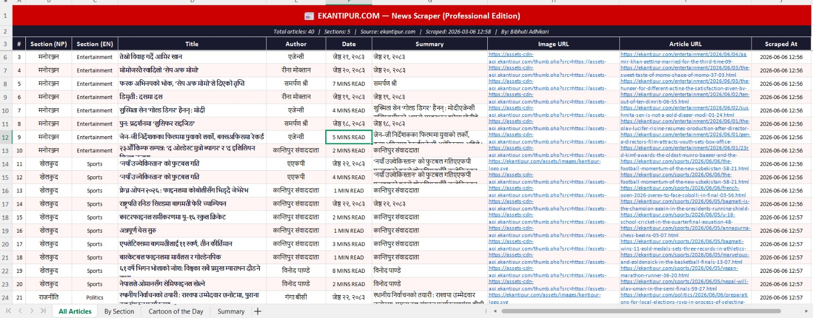

# 📰 Ekantipur News Scraper

Python + Playwright scraper for ekantipur.com —
Nepal's largest Nepali news website.

## 📸 Output Preview

## ✨ Features
- Scrapes Nepali news articles dynamically
- Handles JavaScript rendering with Playwright
- Full Unicode Nepali text support 🇳🇵
- Extracts title, author, date, content, images
- Exports to JSON format

## 🛠️ Technologies
- Python 3
- Playwright
- Pandas
- JSON

## ▶️ How to Run
pip install playwright pandas
playwright install chromium
python ekantipur_scraper.py

## 📊 Data Collected
- Article title (Nepali)
- Author name
- Published date
- Article content
- Image URLs
- Article URL

## 🇳🇵 Why this project?
Ekantipur.com is Nepal's largest news portal.
This scraper handles Nepali Unicode text and
JavaScript-heavy pages perfectly.

## 👤 Author
Bibhuti Adhikari — [bibhutiportfolio.vercel.app](https://bibhutiportfolio.vercel.app)

